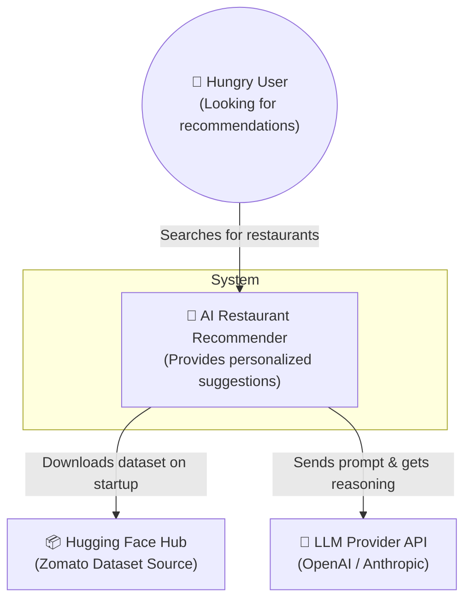
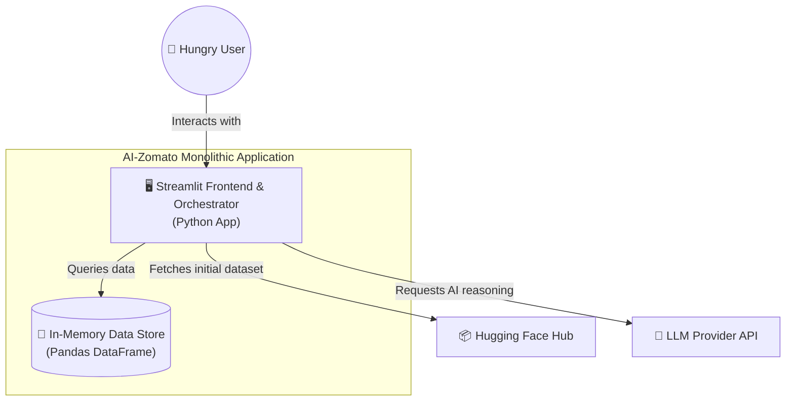
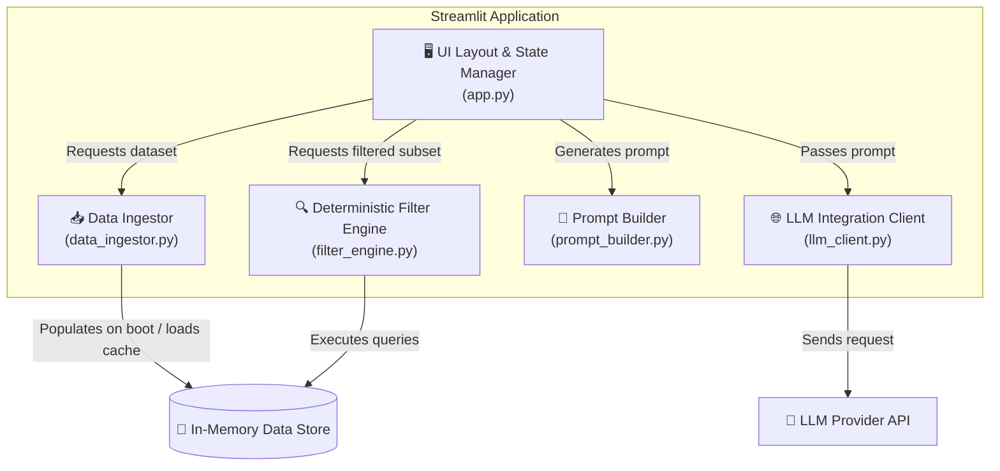
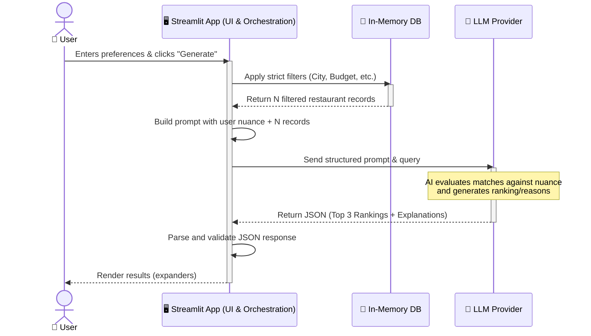

# Architecture: AI-Powered Restaurant Recommendation System

This document outlines the detailed system architecture for the AI-Powered Restaurant Recommendation System based on the Zomato use case.

## 1. Architectural Principles
1. **Separation of Concerns:** Distinct layers for presentation (UI), business logic (Filtering & API), data storage, and AI inference.
2. **Cost & Token Efficiency:** Never send the entire dataset to the LLM. Always apply strict deterministic filtering (location, cost, base cuisine) before passing a small subset to the LLM for contextual reasoning to avoid token limit overflow.
3. **Statelessness:** The backend API should remain stateless to allow for horizontal scaling. User session state (like current search parameters) is maintained by the client (frontend).
4. **Resilience & Fallbacks:** If the LLM API fails or times out, the system should gracefully fallback to returning the top deterministically filtered results without AI explanations.
5. **Data Freshness:** For the scope of this project, the dataset is loaded statically into memory on startup, simulating a read-heavy cache optimized for speed.

## 2. Context Diagram (Level 1)
The Context Diagram illustrates how the system interacts with its environment, including the user and external systems.

## 3. Logical Containers (Level 2)
The logical container view zooms into the monolithic application system.

## 4. Component Level Design (Level 3)
The component view zooms into the Streamlit application to show its internal building blocks.

## 5. System Workflow (End-to-End Execution)

1. **Initialization:** On startup, the application calls the `Data Ingestor` component, which loads the cached CSV or pulls the Zomato dataset from Hugging Face, cleans it, and loads it into memory.
2. **User Request:** User selects Location="Bangalore", Budget="Medium", Cuisine="Italian", and specifies a custom Nuance (e.g., "Romantic date with live music") via the Streamlit interface.
3. **Hard Filtering:** The application calls the `Deterministic Filter Engine` directly to query the DataFrame and filter out irrelevant options based on strict constraints (Location, Budget, Cuisine, Min Rating).
4. **Prompt Construction:** The `Prompt Builder` takes the top 15 results from the filtered subset, strips unnecessary fields to optimize token usage, and constructs the user and system prompts.
5. **LLM Inference:** The `LLM Integration Client` calls the OpenAI or Groq API with the prompts. The LLM evaluates the options against the nuance, selects the top 3 recommendations, and generates justifications.
6. **Response Delivery:** The application parses the structured JSON response and renders it dynamically in the Streamlit UI.

## 6. Sequence Diagram
This diagram maps out the chronological interactions across the monolithic system when a user makes a recommendation request.

